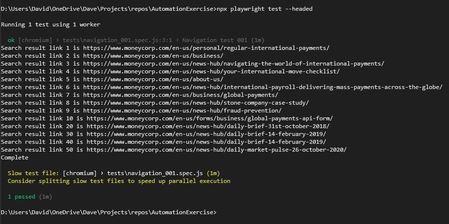

# automation-exercise

# How to setup the tests

## A. Prerequisites

Ensure that you have the following installed:
1.	Development environment, e.g. Visual Studio Community 2022 IDE
2.	Node.js, e.g. 16.14.2
3.	Npm, e.g. 8.5.5
4.	Playwright, e.g. 1.20.0
5.	Git, e.g. 2.35.1

## B. Set-up and usage (Windows)
1. Open a CMD prompt as Administrator
2. Navigate to a suitable location for the project, e.g.
```
cd c:\Users\YourName\Projects
```
4. Clone the repository, e.g.
```
git clone git@github.com:davidatbailey/automationexercise1.git
```
5. Open Visual Studio
6. Choose **File > Open Project/Solution**
7. Navigate to the project's folder and click **Open**
8. Open a Developer Command Prompt and type
```
npm install
```

## C. Running a test
1. Within Visual Studio, open a Developer Command Window and type
```
npx playwright test --headed
```
Example console output:


## D. Running a test with tracing enabled
1. Within Visual Studio, edit the configuration file playwright.config.js to set the value to include
```
use: { trace: 'on' }
```
2. Save the change.
3. Within the Developer Command Prompt, type 
```
npx playwright show-trace test-results\tests-example-basic-test-chromium\trace.zip
```

Made with Playwright

